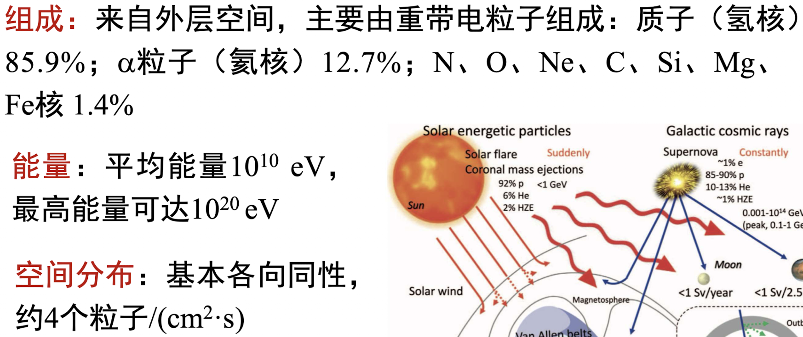
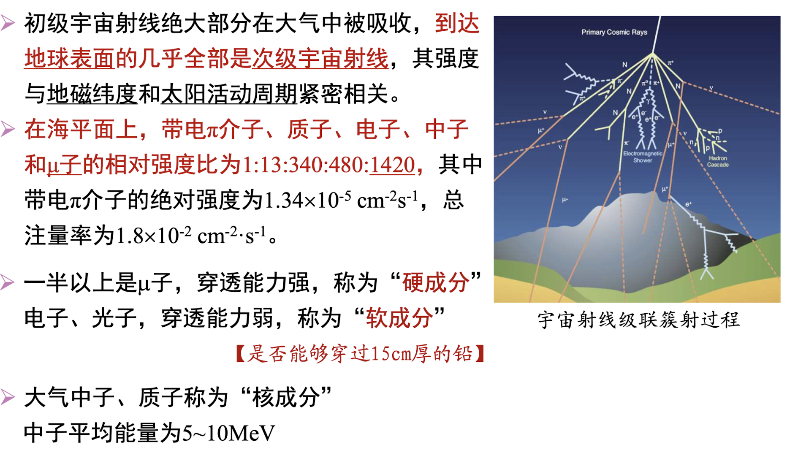
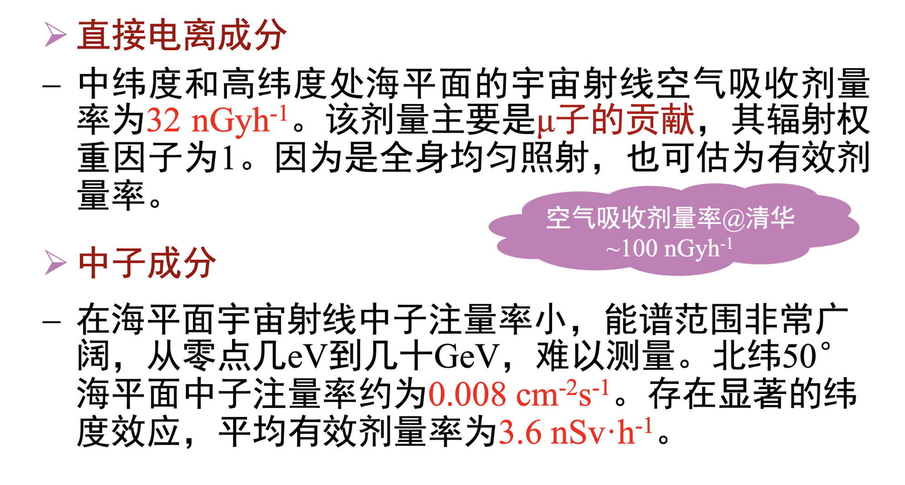
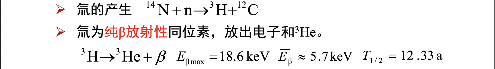
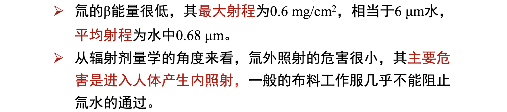
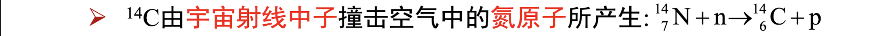
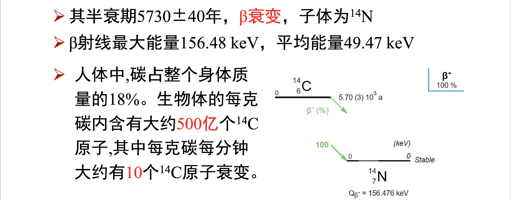

# 天然辐射源
## 宇宙射线
### 初级宇宙射线

### 次级宇宙射线

全世界每年宇宙射线照射有效剂量:$380\mu Sv$

宇宙射线测量选在大水面、远离陆地、使用橡皮船或者木船,以减少$\gamma$辐射的影响
## 宇生放射性核素
$2cm^{-2}s^{-1}$
1. $^3H$
   1. 
   2. 
2. $^{14}C$
   1. 
   2. 
3. $^7Be$
4. $^{22}Na$
## 原生放射性核素

# 人工辐射源

# 辐射源的应用

# 辐射照射的分类

