# 天然辐射源
## 宇宙射线
### 初级宇宙射线

### 次级宇宙射线

全世界每年宇宙射线照射有效剂量:$380\mu Sv$

宇宙射线测量选在大水面、远离陆地、使用橡皮船或者木船,以减少$\gamma$辐射的影响
## 宇生放射性核素
$2cm^{-2}s^{-1}$
1. $^3H$
   1. 
   2. 
2. $^{14}C$
   1. 
   2. 
3. $^7Be$
4. $^{22}Na$

## 原生放射性核素
1. 成系列的放射系:
   1. 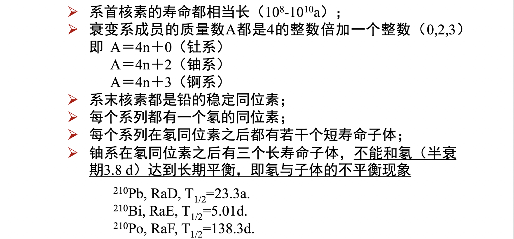
2. 不成系列的
   1. 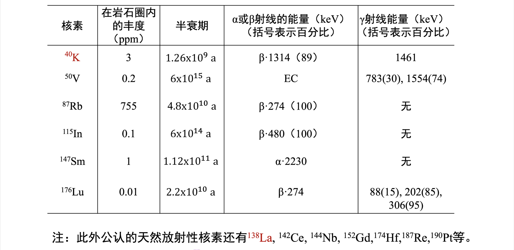
   2. K-40是动物和人体内最大的放射性来源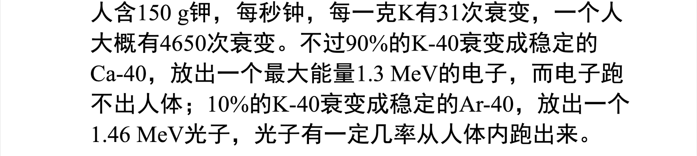
   
外照射主要考虑U-238、Th-232、K-40

内照射主要考虑氡:矿山氡、室内氡(地层、建筑材料、地下水)  
   1. $\alpha$潜能$\varepsilon_p$(表征氡子体危害):氡子体沿衰变链衰变到稳定的铅时释放$\alpha$粒子的**总能量**
   2. $\alpha$潜能浓度$c_p$:单位体积氡子体混合物衰变释放的总能量
   3. $\alpha$潜能照射量$P_p(T)$:一定时间氡潜能浓度对个体暴露时间的积分
   4. 平衡当量浓度$C_{eq}$:当氡和他的短寿命子体处于平衡状态,并且和非平衡混合物相同的相同的$\alpha$潜能浓度时的氡活度浓度(当量--$\alpha$潜能浓度相当)
   5. 平衡因子$F$:平衡当量浓度和空气中实际氡浓度的比值(表征空气中短寿命氡子体混合物和氡之间的不平衡程度)

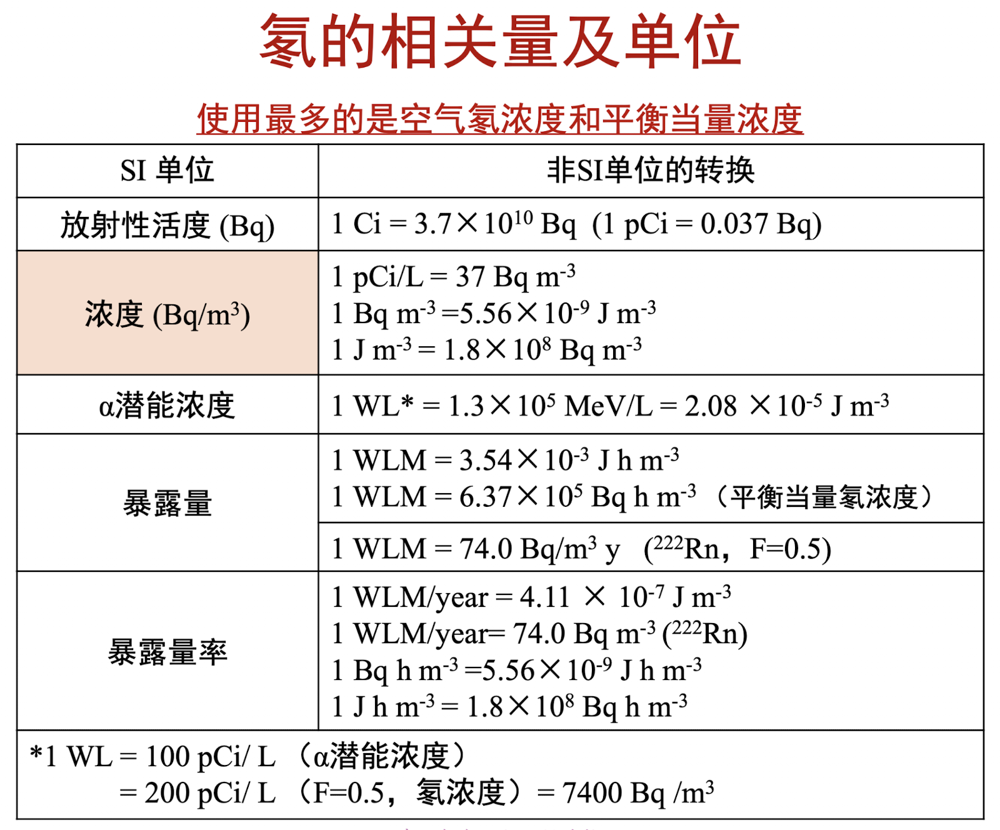

## 放射性同位素源

### 密封源

源芯、源壳、容器

1. 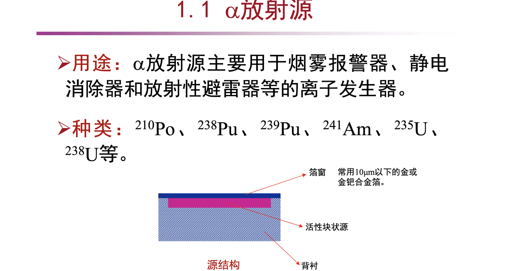
   电离能力强、射程有限
   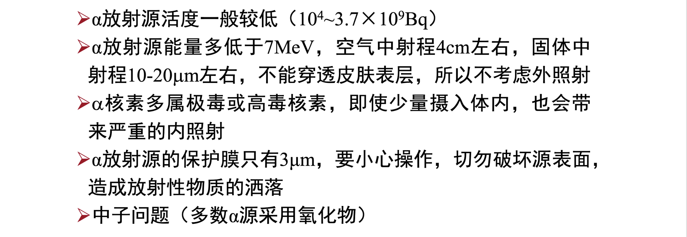
2. 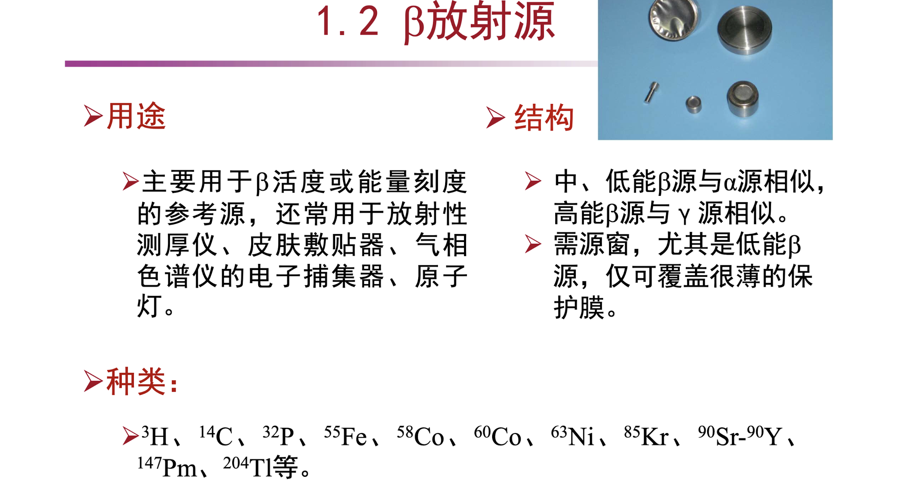
   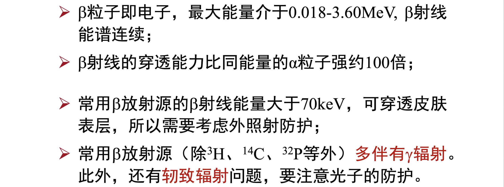
3. 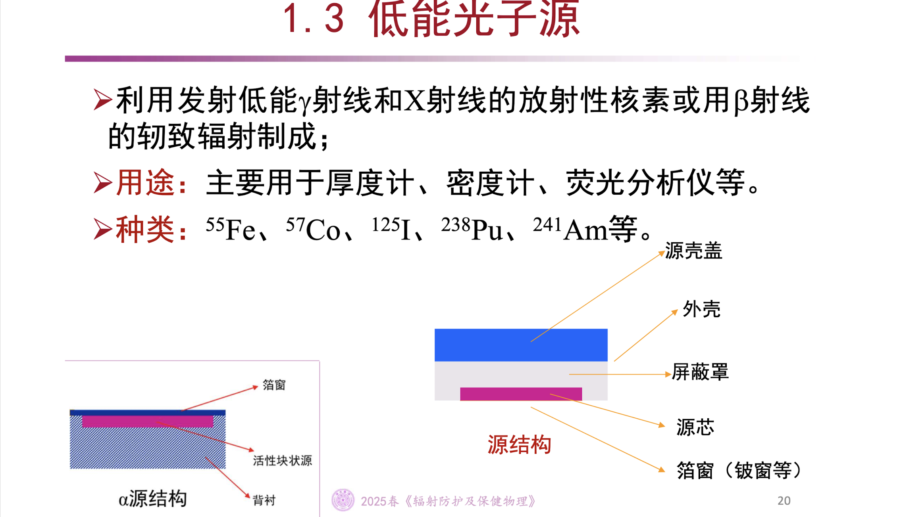
   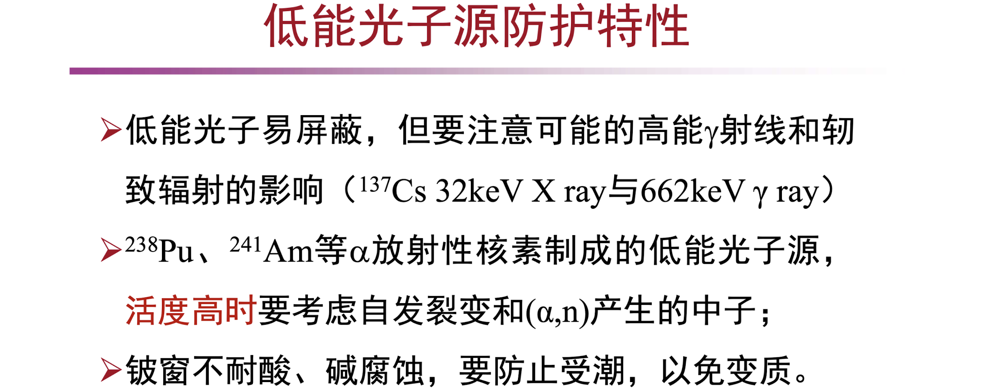
4. 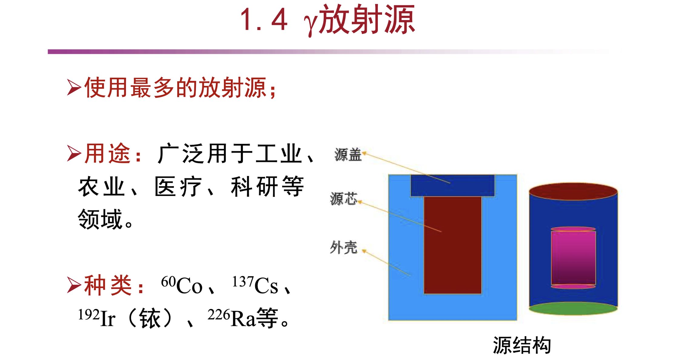
   Ir-192:工业探伤
   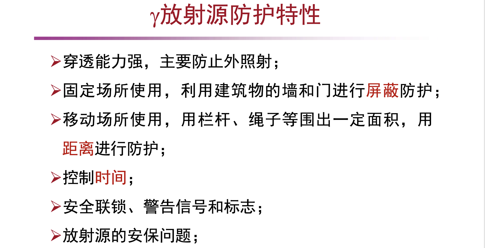
5. 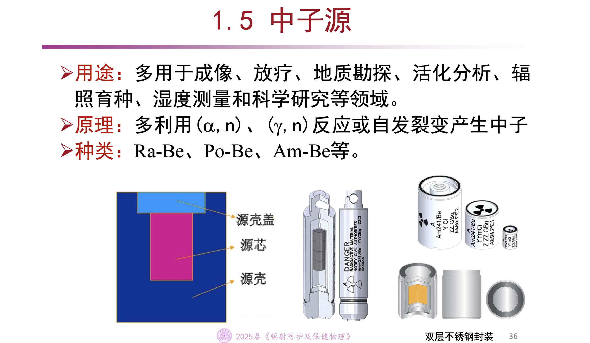
   Cf-252:核电站启动中子源
   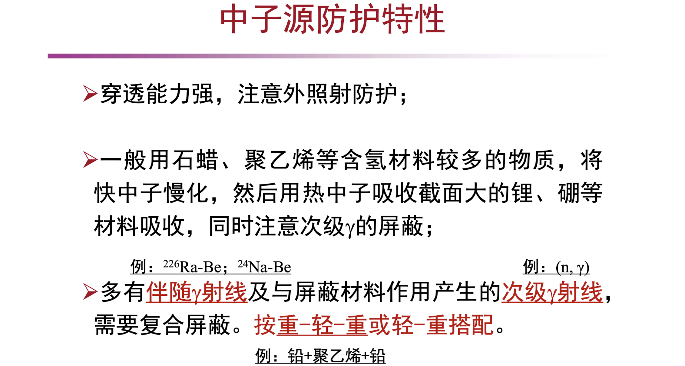
6. 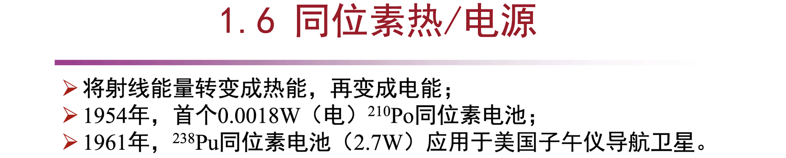

### 非密封源

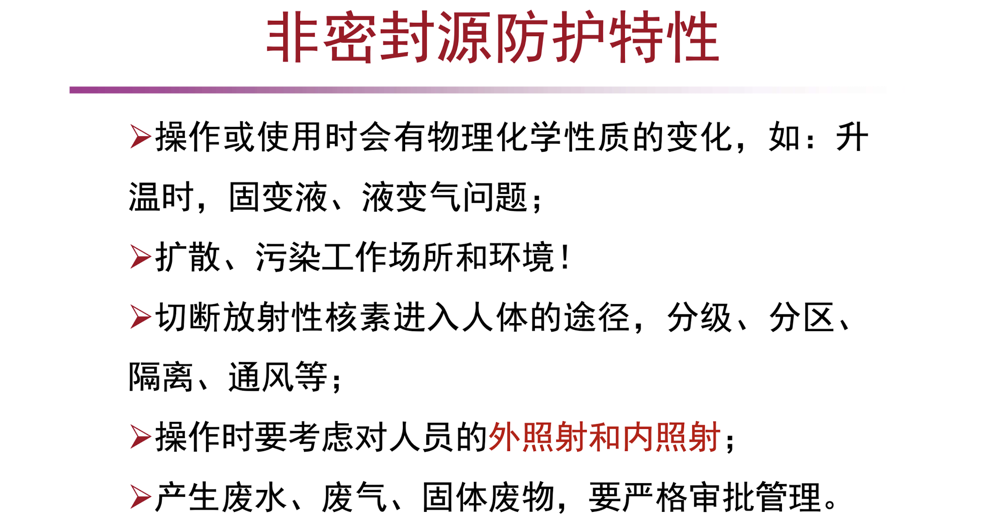

## 射线装置

### x射线机

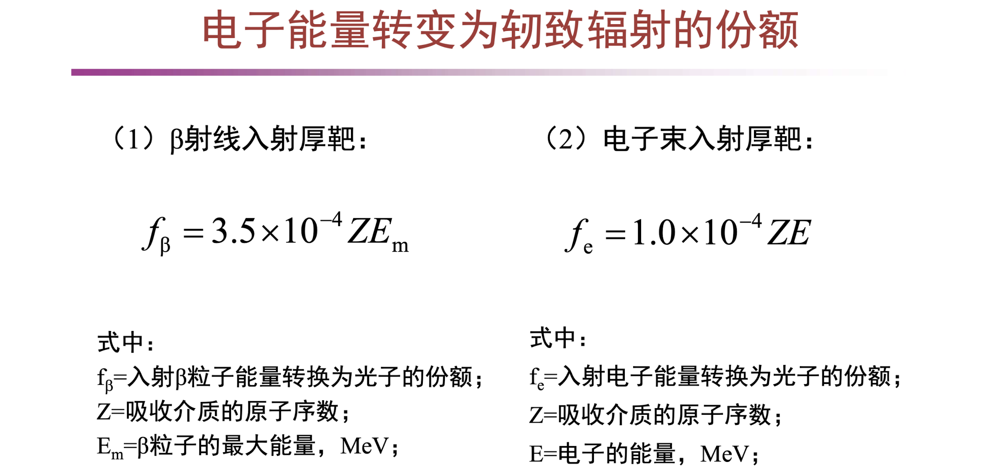

### 中子发生器

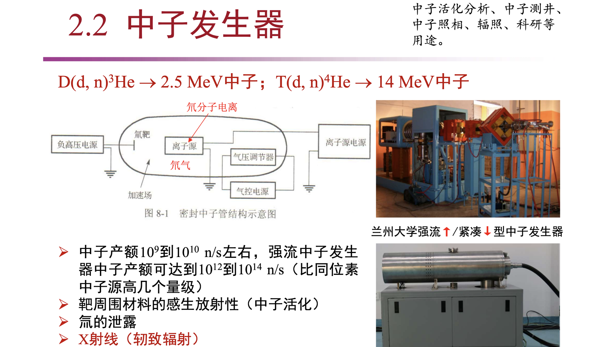

### 加速器

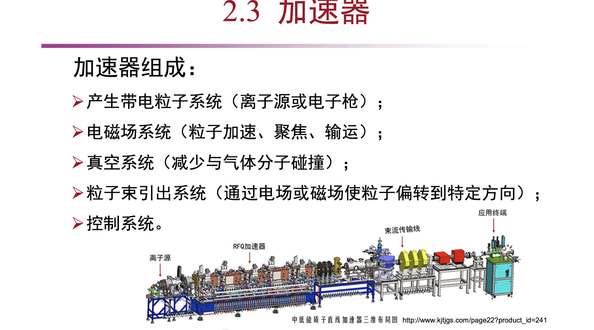

## 核设施

# 辐射源的应用

# 辐射照射的分类

